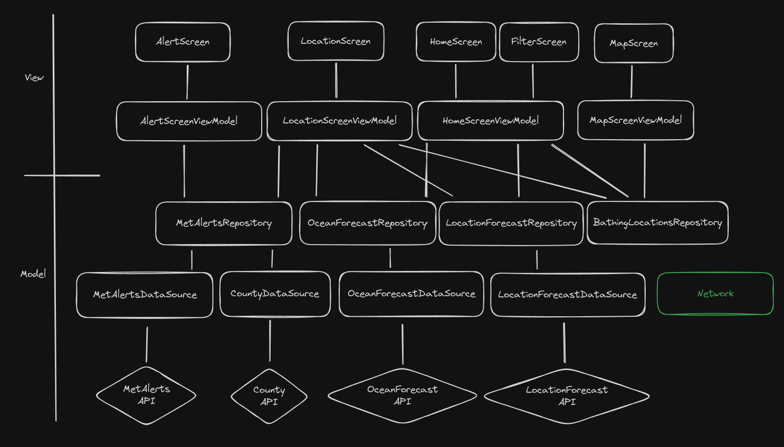

<html>
<body>
<h1>Arkitektur</h1>

For å skille de forskjellige ansvarsområdene i applikasjonen, har vi valgt å gå for MVVM arkitektur. Dette er mest for å spesifikt separere abstraksjonsnivåene og ansvarsområdene, men tillater også for mulig ekspansjon i fremtiden.

Business-logikken blir håndtert i Model-laget og delvis ViewModel. I DataSource blir rådata (eller selve informasjonen) hentet, i repositoriene håndtert og tilpasset (hvis nødvendig), og i ViewModel lagret i en bestemt uiState for å kunne brukes videre i user interface - der brukeren direkte interagerer med det.

Ved å bruke MVVM oppnår vi dermed en fast dataflyt mellom ansvarsområdene, ved å sikre høy kohesjon og kontrollert dataflyt, i tillegg til lav kobling.

Nettverksdelen er litt spesiell. Vi bestemte å kalle på den fra MainActivity som en egen rutine. Dette var delvis for å forsikre oss om at ingen API-er eller annet som trengte nettverkforbindelse som vi ikke hadde tenkt på ville få appen til å krasje, men også for å forbedre brukeropplevelsen så den ikke blokkerte hovedtråden.

<h4>Lav kobling:</h4>
Hver funksjon eller metode er lagt opp for å gjøre spesifikt én ting i ett område, og kun fokusere på den tingen. Hver metode i klassene er laget for å være så lite avhengige av hverandre som mulig, gjerne direkte uavhengige. Dette er for at det skal være mulig å oppdatere en metode uten å påvirke de andre.
    <ul></ul> <!-- hverken linjeskift eller   funker ikke? -->
Vi har oppnådd dette med bruk av Separation of Concerns (SoC) gjennom å organisere koden vår i separate elementer, hvor hver av dem har et tydelig definert ansvarsområde. For eksempel har vi delt koden inn i View, ViewModel og Model i henhold til MVVM-arkitekturen. Men det samme gjelder også omtrent hver metode og funksjon i applikasjonen.

<h4>Høy kohesjon:</h4>
Mesteparten av klassene og dens metoder som er relatert, ligger i utgangspunktet på samme sted. Dette er for å forminske avhengighet og opprette et tydelig ansvarsområde. Vi kan illustrere dette nærmere med Single Source of Truth (SSOT) ettersom dette ligger i tråd med høy kohesjon, tett relatert kode som høres sammen burde ligge på samme sted.
    <ul></ul>
Dette er spesielt tydelig i repositoriene, siden ved å kun hente data gjennom hvert repository sikrer vi at dataen er konsistent/lik over hele applikasjonen til enhver tid.
Men dette er også tilfellet i andre aspekter av applikasjonen, f.eks. uiState i ViewModel. Her kan vi sikre at UI-tilstanden blir konsekvent alle steder den er brukt, når uiState oppdateres.

<h3>Android- og API-versjon:</h3>
Vi har valgt Android versjon 8 og API versjon 26 som minstekrav. Dette er fordi Android lifecycle krevde API versjon 26 som minimumskrav og kunne ikke støtte noe lavere. Derfor kan kun Android versjoner 8 og oppover bruke denne applikasjonen. Likevel er ikke eldre versjoner garantert til å få full funksjonalitet, da vi har tilpasset appen for nyere versjoner spesifikt. 

<h3>Teknologier som er benyttet:</h3>
Android Studio:
<ul>
    <li>JetPack Compose</li>
    <li>Kotlin</li>
</ul>
Git+GitHub:
<ul>
    <li>Branching modell:</li>
    <ul>
        <li>GitFlow</li>
    </ul>
</ul>
Biblioteker:
<ul>
    <li>Coil</li>
    <li>Gson</li>
    <li>Firebase</li>
    <li>Ktor</li>
    <li>Accompanist</li>
    <li>Navigation Compose</li>
    <li>JUnit</li>
    <li>Espresso</li>
    <li>Dokka</li>
</ul>
SDK:
<ul>
    <li>MapBox</li>
</ul>
</body>
</html>
