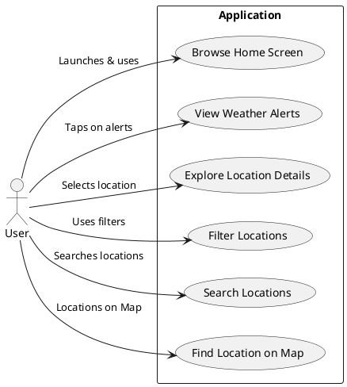
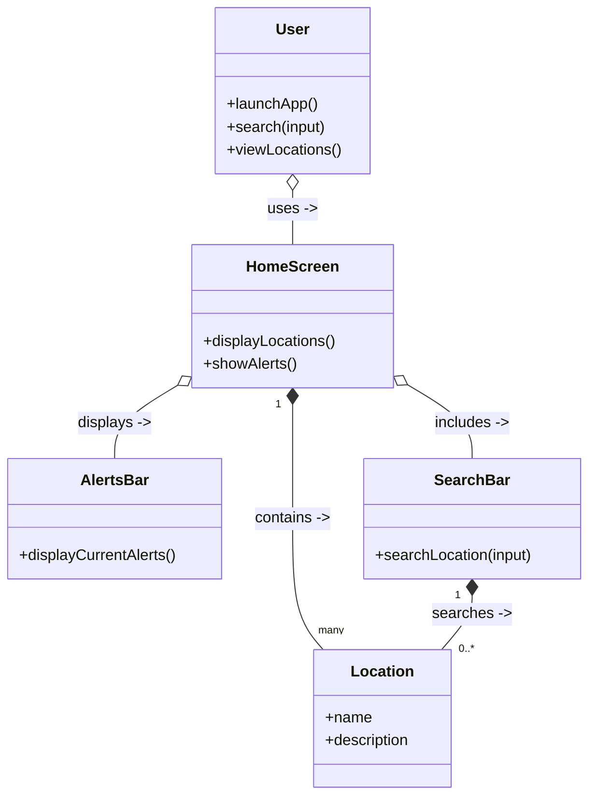
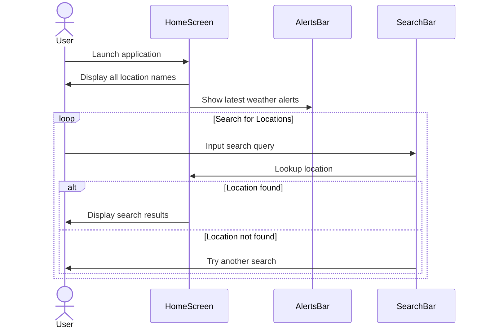
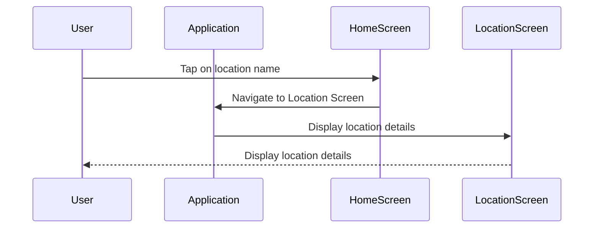
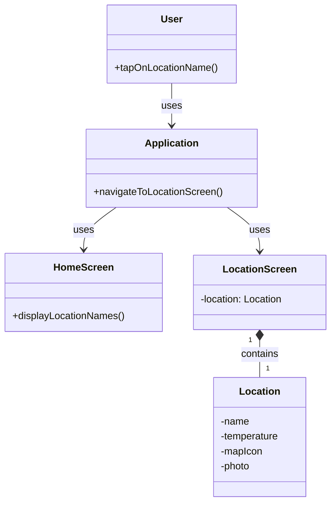
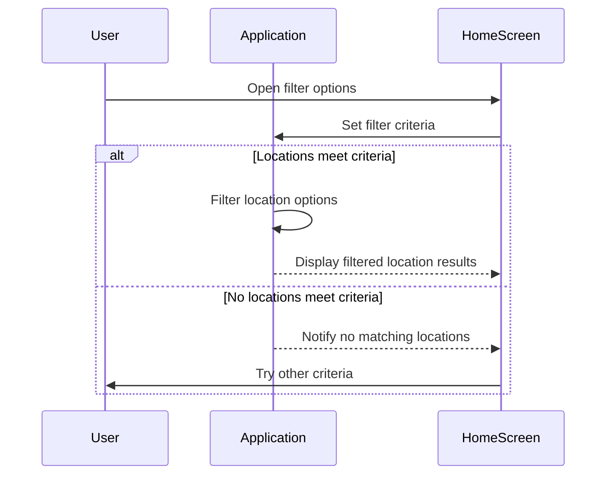
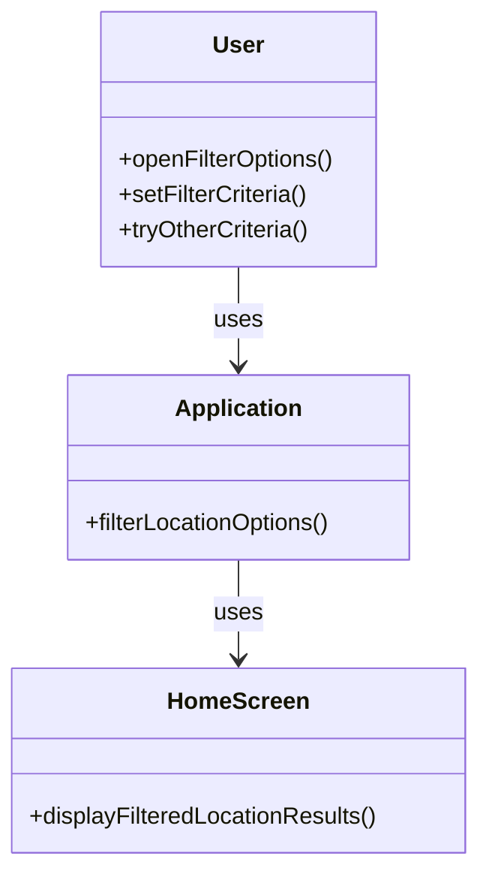
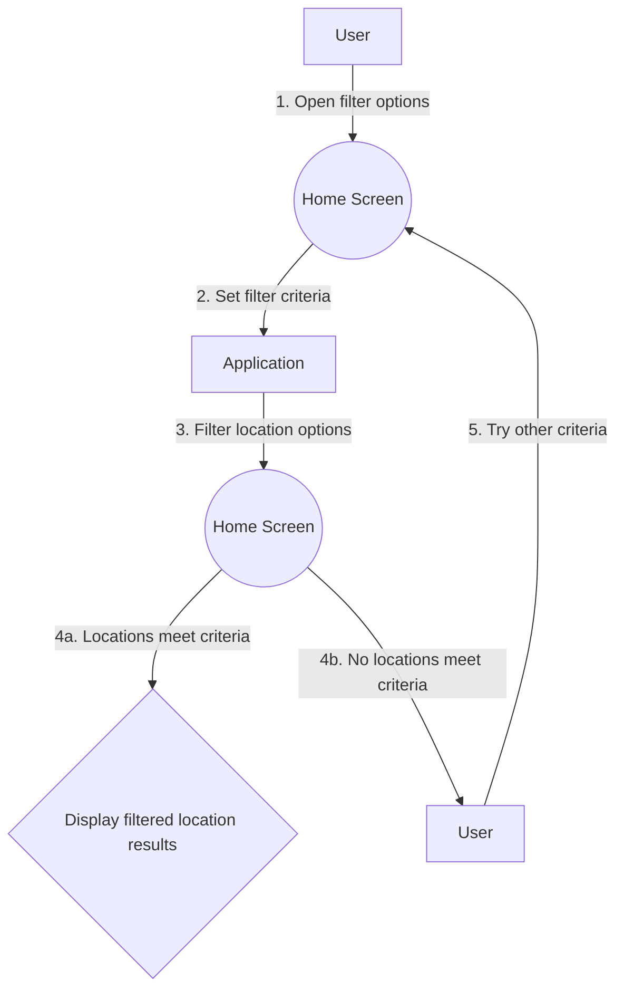

# Modeling

### Use Case Diagram

## Diagram Forklaring
Actorer:
Bruker: Den primære aktøren som samhandler med systemet.
Use Caser:
- Bla gjennom Home Screen: Brukeren samhandler med Home Screen for å se alle stedsnavn, bruke Search Bar og se en Alert Bar.
- Vis Værvarsler: Brukeren ser detaljerte varsler ved å gå til Alert Screen.
- Utforsk Posisjonsdetaljer: Brukeren viser detaljert informasjon om en posisjon, inkludert bilder og temperatur, på posisjonsskjermen.
- Filter Lokasjoner: Brukeren filtrerer lokasjoner basert på avstand og tilgjengelige fasiliteter.
- Brukeren kan finne lokasjoner på kart.
Relasjoner: Hvert brukstilfelle er direkte knyttet til brukeren, noe som indikerer at brukeren initierer og samhandler med disse funksjonene.
Dette diagrammet gir en klar visuell representasjon av nøkkelinteraksjonene i applikasjonen vår, i samsvar med use casene som er diskutert. Hvert use casene presenteres som en vei brukeren kan ta i applikasjonen, som gjenspeiler rekkefølgen og omfanget av interaksjoner.

## Use Case 1: Bla gjennom Home Screen

- Navn: Bla gjennom Home Screen
- Skuespiller: Bruker
- Beskrivelse: Brukeren blar gjennom Home Screen for å se alle stedsnavn, bruke en Search Bar for spesifikke steder og se en Alert Bar.
- Forutsetninger: Brukeren har applikasjonen installert og har åpnet Home Screen.
- Trigger: Applikasjonen åpnes.
- Hoved Flyt:
   1. Brukeren starter applikasjonen.
   2.  Home Screen lastes inn og viser alle stedsnavn.
   3. Alert Bar øverst viser de siste værvarslene.
   4. Brukeren bruker Search Bar for å finne et bestemt sted.
- Alternativer:
  Hvis ingen plassering samsvarer med søket, prøv en annen Location.
- Postbetingelser: Brukeren har bla gjennom Home Screen og benyttet søkefunksjonen.

# Klasse Diagram

# Sekvensdiagram

## Use Case 2: Utforsk posisjonsdetaljer

- Navn: Utforsk posisjonsdetaljer
- Skuespiller: Bruker
- Beskrivelse: Brukeren viser detaljer om et sted, inkludert navn, bilder, badetemperatur og kartikon .
- Forutsetninger: Brukeren har valgt en lokasjon fra Home Screen.
- Trigger: Brukeren trykker på et stedsnavn.
- Hoved Flyt:
  1. Brukeren velger en Lokasjon ved å trykke på navnet.
  2. Applikasjonen går over til Location Screen.
  3. Location Screen viser stedsnavn, bilder, badetemperatur og kartikon.
- Postbetingelser: Brukeren har utforsket detaljene til et sted.

# Sekvensdiagram

# Klassediagram

## Use Case 3: Filtrer Lokasjoner

- Navn: Filtrer Lokasjoner
- Skuespiller: Bruker
- Beskrivelse: Brukeren filtrerer steder basert på avstand og tilgjengelige fasiliteter.
- Forutsetninger: Brukeren er på Home Screen med plasseringsalternativer vist.
- Trigger: Brukeren åpner Filter Bar.
- Hoved Flyt:
  1. Brukeren får tilgang til filter alternativene på Home Screen.
  2. Brukeren setter filterkriterier for avstand og fasiliteter.
  3. Applikasjonen filtrerer plasseringsalternativene basert på de valgte kriteriene.
  4. Applikasjonen viser de filtrerte lokasjon resultatene til brukeren.
- Alternativer:
  -Hvis ingen steder oppfyller kriteriene, kan brukeren prøve andre kriterier.
- Postbetingelser: Brukeren har en liste over steder som samsvarer med deres filter preferanser.

# Sekvensdiagram

# Klassediagram

# Aktivitetsdiagram

